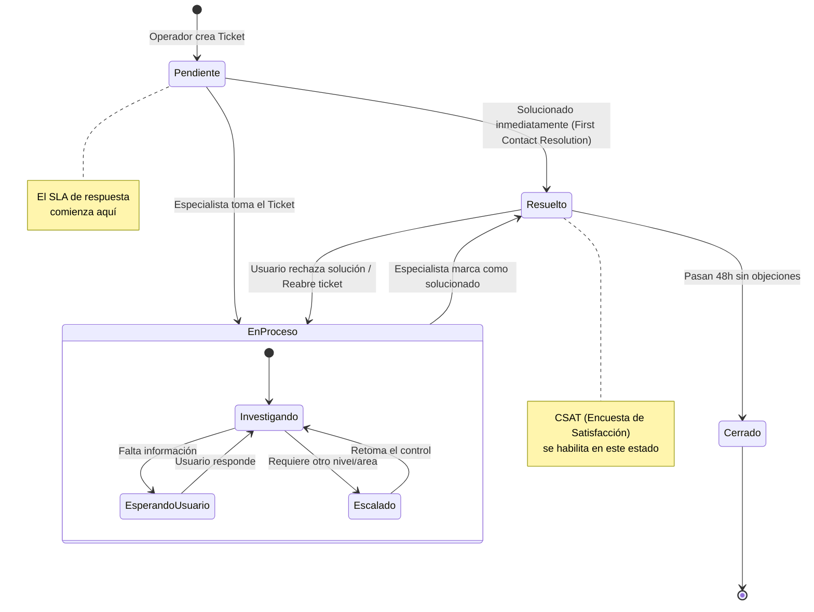
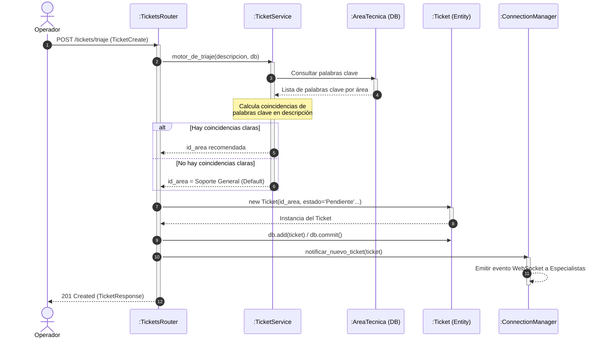
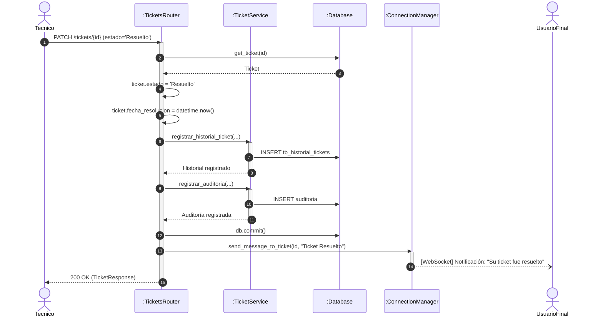

# Modelado de Comportamiento (UML)

Para complementar el diagrama de clases, aquí se presentan los diagramas de comportamiento del sistema Helpdesk, ilustrando cómo interactúan los objetos a lo largo del tiempo.

---

## 1. Diagrama de Estados (State Machine) — Ciclo de Vida del Ticket

Este diagrama muestra los estados por los que pasa un objeto `Ticket` desde su creación hasta su cierre, y los eventos que desencadenan las transiciones.

---

## 2. Diagrama de Secuencia — Flujo de Triaje Inteligente

Muestra la interacción de los objetos en la capa de Presentación, Servicio y Datos cuando un Operador crea un nuevo Ticket y el sistema realiza la asignación automática.

---

## 3. Diagrama de Secuencia — Resolución y Notificación (WebSockets)

Describe el flujo cuando un Técnico resuelve un ticket, incluyendo la actualización del historial y las notificaciones en tiempo real a los clientes conectados.

