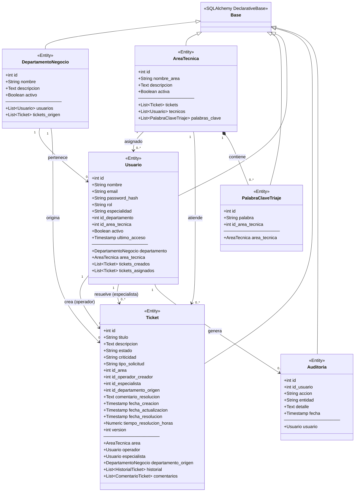
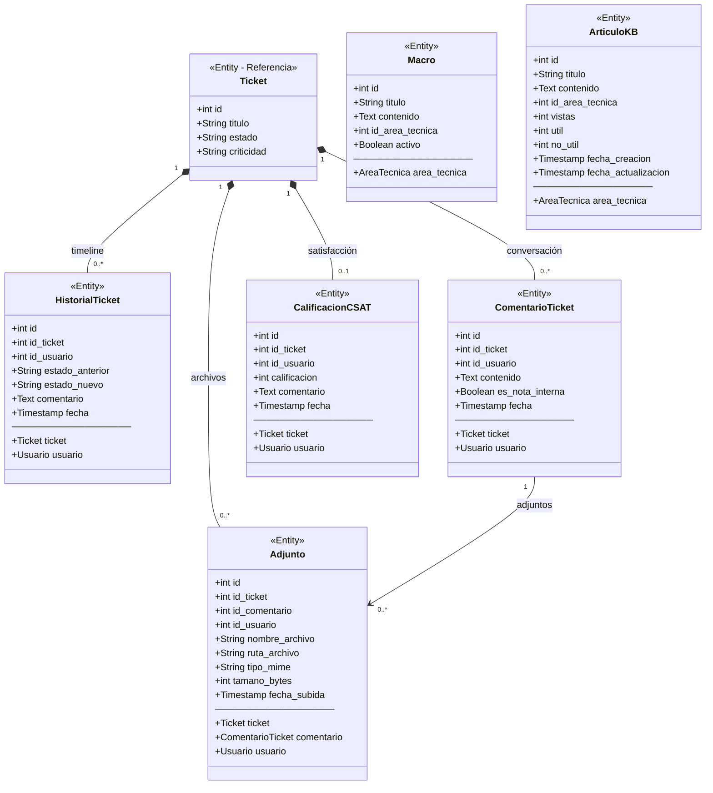
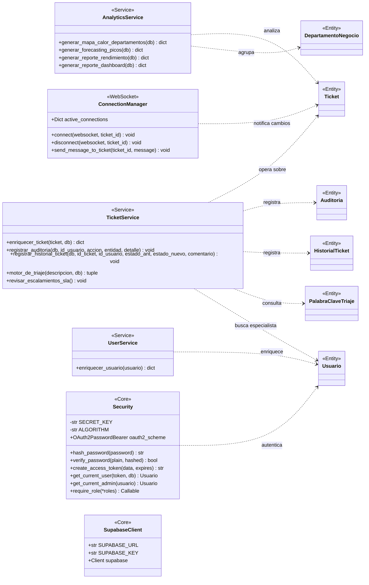
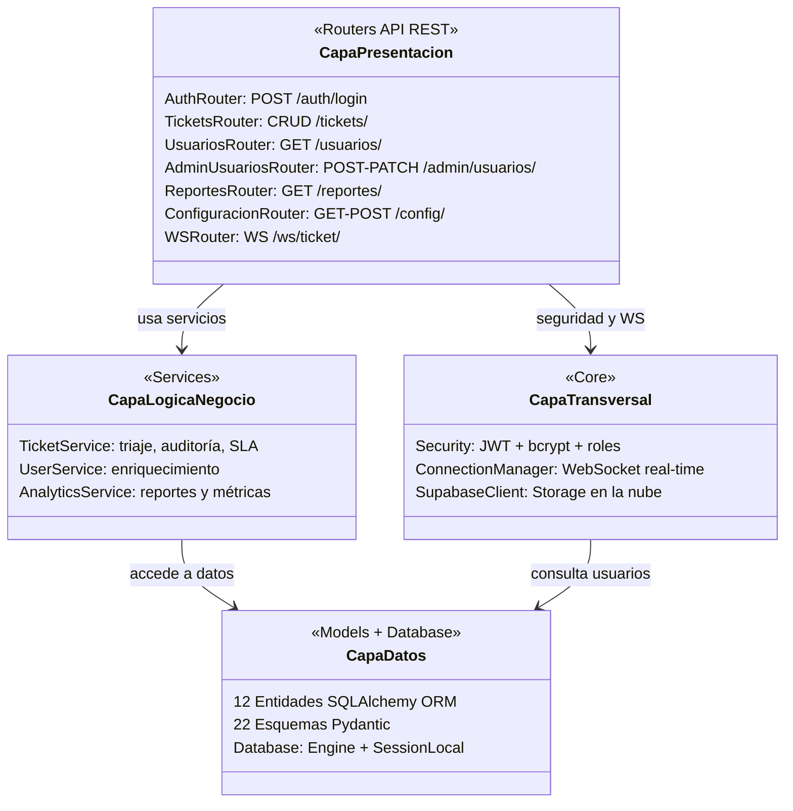

# Modelado de Clases — Paradigma Orientado a Objetos (POO)

## Sistema Helpdesk Multiparadigma v2.1

---

## 1. Diagrama de Clases — Entidades Principales del Dominio

### Descripción de las Clases Principales

| Clase | Tabla | Descripción |
|-------|-------|-------------|
| **DepartamentoNegocio** | `tb_departamentos_negocio` | Departamento de negocio que origina el problema (Marketing, Ventas, ATC, Operaciones, RRHH). Cada departamento tiene usuarios y tickets asociados. |
| **AreaTecnica** | `areas_tecnicas` | Área técnica destino del soporte (Redes, Hardware, Software, Soporte General, Seguridad). Contiene técnicos especializados y palabras clave para el triaje automático. |
| **PalabraClaveTriaje** | `tb_palabras_clave_triaje` | Palabras clave dinámicas utilizadas por el motor de triaje inteligente para clasificar tickets automáticamente según su descripción. Relación de composición con `AreaTecnica` (cascade delete). |
| **Usuario** | `usuarios` | Usuario del sistema con tres roles posibles: **Administrador** (gestión total), **Operador** (crea tickets, requiere departamento) y **Técnico** (resuelve tickets, requiere área técnica). Incluye autenticación con contraseña encriptada (bcrypt). |
| **Ticket** | `tickets` | Ticket de soporte técnico. Entidad central del sistema con trazabilidad completa: estados (Pendiente → En Proceso → Resuelto), criticidad (Baja/Media/Alta/Critica), control de concurrencia optimista mediante campo `version`, y cálculo automático del tiempo de resolución. |
| **Auditoria** | `auditoria` | Registro inmutable de todas las acciones realizadas en el sistema (creación de tickets, cambios de estado, gestión de usuarios), garantizando la trazabilidad completa. |

---

## 2. Diagrama de Clases — Entidades de Soporte y Trazabilidad

### Descripción de las Clases de Soporte

| Clase | Tabla | Descripción |
|-------|-------|-------------|
| **HistorialTicket** | `tb_historial_tickets` | Línea de tiempo (timeline) que registra cada transición de estado de un ticket. Permite auditar quién cambió qué y cuándo, incluyendo comentarios opcionales en cada transición. |
| **ComentarioTicket** | `tb_comentarios_tickets` | Hilo de conversación del ticket (estilo Zendesk). Soporta comentarios públicos y notas internas visibles solo para el equipo técnico. |
| **CalificacionCSAT** | `tb_csat` | Customer Satisfaction Score. Calificación del 1 al 5 que el usuario asigna a un ticket resuelto. Relación 1:1 con Ticket (un ticket solo puede ser calificado una vez). |
| **Adjunto** | `tb_adjuntos` | Archivos adjuntos (imágenes, PDFs, logs) asociados a tickets o comentarios específicos. Soporta almacenamiento en Supabase Storage con fallback local. Validación de tipo MIME y tamaño máximo de 10 MB. |
| **Macro** | `tb_macros` | Respuestas predefinidas para técnicos. Pueden ser globales (sin área) o específicas de un área técnica, agilizando la resolución de tickets recurrentes. |
| **ArticuloKB** | `tb_articulos_kb` | Base de Conocimientos (Knowledge Base) para autoservicio. Artículos categorizados por área técnica con métricas de utilidad (vistas, útil/no útil). |

---

## 3. Diagrama de Clases — Capa de Servicios y Core

### Descripción de Servicios y Core

| Clase | Módulo | Responsabilidad |
|-------|--------|-----------------|
| **TicketService** | `services/ticket_service.py` | Lógica de negocio central: enriquecimiento de tickets con datos de relaciones, motor de triaje inteligente basado en palabras clave, registro de auditoría y historial, y escalamiento automático de SLA (cron cada 15 min). |
| **UserService** | `services/user_service.py` | Enriquecimiento de objetos Usuario con nombres de departamento y área técnica para las respuestas de la API. |
| **AnalyticsService** | `services/analytics_service.py` | Generación de reportes analíticos: mapa de calor por departamentos, forecasting de picos horarios, métricas de rendimiento por área (promedio, mediana, desviación estándar), y dashboard general. |
| **Security** | `core/security.py` | Autenticación y autorización: encriptación de contraseñas con bcrypt, generación y validación de tokens JWT (HS256), middleware de roles (Admin, Operador, Técnico). |
| **ConnectionManager** | `routers/ws.py` | Gestor de conexiones WebSocket en tiempo real. Mantiene un mapa de ticket_id → lista de WebSockets conectados para notificaciones instantáneas de cambios y nuevos comentarios. |
| **SupabaseClient** | `core/supabase_client.py` | Cliente de Supabase para almacenamiento de archivos adjuntos en la nube (Storage). Inicialización condicional basada en variables de entorno. |

---

## 4. Diagrama de Arquitectura por Capas

### Flujo de Dependencias

| Capa | Componentes | Dirección |
|------|-------------|-----------|
| **Presentación** | 7 Routers (auth, tickets, usuarios, admin, reportes, config, ws) | → Servicios, Core |
| **Lógica de Negocio** | TicketService, UserService, AnalyticsService | → Datos |
| **Transversal (Core)** | Security, ConnectionManager, SupabaseClient | → Datos |
| **Datos** | 12 Entidades ORM, 22 Schemas Pydantic, Database config | Base |

---

## 5. Principios POO Aplicados

| Principio | Implementación en el Sistema |
|-----------|------------------------------|
| **Encapsulamiento** | Cada clase ORM encapsula sus atributos y relaciones. Los servicios encapsulan la lógica de negocio separándola de los routers. La clave JWT `SECRET_KEY` es privada en `Security`. |
| **Herencia** | Las 12 entidades heredan de `Base` (SQLAlchemy DeclarativeBase). Los 22 esquemas Pydantic heredan de `BaseModel`. |
| **Polimorfismo** | El campo `rol` en `Usuario` determina el comportamiento: Operador (crea tickets), Técnico (resuelve tickets), Administrador (gestión total). El método `require_role(*roles)` genera dependencias polimórficas. |
| **Abstracción** | La capa de servicios abstrae la complejidad del triaje, auditoría y analytics. Los routers solo invocan métodos de servicio sin conocer la implementación interna. |
| **Composición** | `Ticket` se compone de `HistorialTicket`, `ComentarioTicket`, `Adjunto` y `CalificacionCSAT` (cascade delete). `AreaTecnica` se compone de `PalabraClaveTriaje`. |
| **Asociación** | `Usuario` se asocia con `DepartamentoNegocio` y `AreaTecnica`. `Ticket` se asocia con `Usuario` (operador y especialista) y `AreaTecnica`. |

---

## 6. Patrones de Diseño Utilizados

| Patrón | Dónde se aplica |
|--------|-----------------|
| **Repository** | SQLAlchemy ORM actúa como repositorio, abstrayendo el acceso a la BD PostgreSQL/Supabase. |
| **Dependency Injection** | FastAPI inyecta dependencias (`Depends(get_db)`, `Depends(get_current_user)`) en cada endpoint. |
| **Factory** | `require_role(*roles)` es una función factory que genera dependencias de autorización parametrizadas. |
| **Observer** | `ConnectionManager` implementa el patrón Observer para WebSockets: cuando un ticket cambia, notifica a todos los clientes suscritos. |
| **Strategy** | El motor de triaje aplica diferentes estrategias de asignación según las palabras clave detectadas en la descripción del ticket. |
| **Optimistic Locking** | El campo `version` en `Ticket` implementa control de concurrencia optimista para evitar conflictos de escritura simultánea. |
