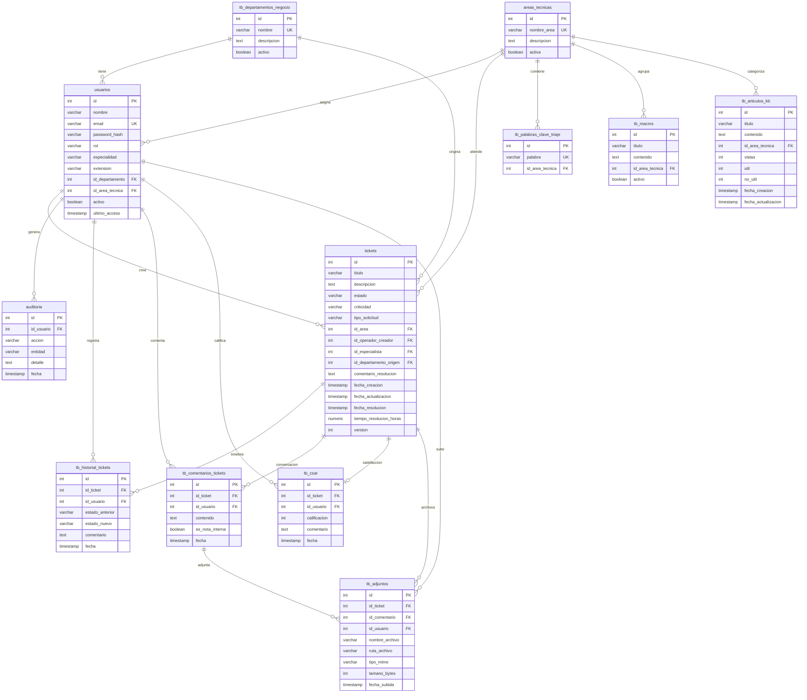

# Modelo Físico de la Base de Datos — Sistema Helpdesk

## Conecta Soluciones BPO — v2.1 | PostgreSQL (Supabase)

---

## 1. Diagrama Entidad-Relación (ER)

---

## 2. Diccionario de Tablas

### 2.1 `tb_departamentos_negocio` — Departamentos de Negocio

> Origen del problema: el departamento del operador que reporta la falla.

| # | Columna | Tipo | Nulable | Default | Restricciones |
|---|---------|------|---------|---------|---------------|
| 1 | `id` | `SERIAL` | NO | Auto-incremental | **PK** |
| 2 | `nombre` | `VARCHAR(100)` | NO | — | **UNIQUE** |
| 3 | `descripcion` | `TEXT` | SÍ | — | — |
| 4 | `activo` | `BOOLEAN` | NO | `TRUE` | — |

---

### 2.2 `areas_tecnicas` — Áreas Técnicas

> Destino del soporte: el área técnica que resuelve el problema.

| # | Columna | Tipo | Nulable | Default | Restricciones |
|---|---------|------|---------|---------|---------------|
| 1 | `id` | `SERIAL` | NO | Auto-incremental | **PK** |
| 2 | `nombre_area` | `VARCHAR(100)` | NO | — | **UNIQUE** |
| 3 | `descripcion` | `TEXT` | SÍ | — | — |
| 4 | `activa` | `BOOLEAN` | NO | `TRUE` | — |

---

### 2.3 `usuarios` — Usuarios del Sistema

> Tres roles: **Administrador** (gestión total), **Operador** (crea tickets), **Técnico** (resuelve tickets).

| # | Columna | Tipo | Nulable | Default | Restricciones |
|---|---------|------|---------|---------|---------------|
| 1 | `id` | `SERIAL` | NO | Auto-incremental | **PK** |
| 2 | `nombre` | `VARCHAR(150)` | NO | — | — |
| 3 | `email` | `VARCHAR(150)` | NO | — | **UNIQUE** |
| 4 | `password_hash` | `VARCHAR(255)` | NO | — | Encriptado con bcrypt |
| 5 | `rol` | `VARCHAR(50)` | NO | — | **CHECK** `IN ('Operador', 'Tecnico', 'Administrador')` |
| 6 | `especialidad` | `VARCHAR(100)` | SÍ | — | — |
| 7 | `extension` | `VARCHAR(20)` | SÍ | — | — |
| 8 | `id_departamento` | `INTEGER` | SÍ | — | **FK** → `tb_departamentos_negocio(id)` ON DELETE SET NULL |
| 9 | `id_area_tecnica` | `INTEGER` | SÍ | — | **FK** → `areas_tecnicas(id)` ON DELETE SET NULL |
| 10 | `activo` | `BOOLEAN` | NO | `TRUE` | — |
| 11 | `ultimo_acceso` | `TIMESTAMPTZ` | SÍ | — | — |

**Reglas de negocio:**
- Si `rol = 'Operador'` → `id_departamento` es obligatorio
- Si `rol = 'Tecnico'` → `id_area_tecnica` es obligatorio

---

### 2.4 `tickets` — Tickets de Soporte

> Entidad central del sistema con trazabilidad completa.

| # | Columna | Tipo | Nulable | Default | Restricciones |
|---|---------|------|---------|---------|---------------|
| 1 | `id` | `SERIAL` | NO | Auto-incremental | **PK** |
| 2 | `titulo` | `VARCHAR(200)` | NO | — | — |
| 3 | `descripcion` | `TEXT` | NO | — | — |
| 4 | `estado` | `VARCHAR(50)` | NO | `'Pendiente'` | **CHECK** `IN ('Pendiente', 'En Proceso', 'Resuelto', 'Cancelado')` |
| 5 | `criticidad` | `VARCHAR(50)` | NO | — | **CHECK** `IN ('Baja', 'Media', 'Alta', 'Critica')` |
| 6 | `tipo_solicitud` | `VARCHAR(50)` | NO | `'Incidente'` | **CHECK** `IN ('Incidente', 'Peticion')` |
| 7 | `id_area` | `INTEGER` | SÍ | — | **FK** → `areas_tecnicas(id)` ON DELETE SET NULL |
| 8 | `id_operador_creador` | `INTEGER` | SÍ | — | **FK** → `usuarios(id)` ON DELETE SET NULL |
| 9 | `id_especialista` | `INTEGER` | SÍ | — | **FK** → `usuarios(id)` ON DELETE SET NULL |
| 10 | `id_departamento_origen` | `INTEGER` | SÍ | — | **FK** → `tb_departamentos_negocio(id)` ON DELETE SET NULL |
| 11 | `comentario_resolucion` | `TEXT` | SÍ | — | — |
| 12 | `fecha_creacion` | `TIMESTAMPTZ` | SÍ | `CURRENT_TIMESTAMP` | — |
| 13 | `fecha_actualizacion` | `TIMESTAMPTZ` | SÍ | — | — |
| 14 | `fecha_resolucion` | `TIMESTAMPTZ` | SÍ | — | — |
| 15 | `tiempo_resolucion_horas` | `NUMERIC(5,2)` | SÍ | — | Calculado automáticamente |
| 16 | `version` | `INTEGER` | NO | `1` | Optimistic Locking |

---

### 2.5 `auditoria` — Auditoría General

> Registro inmutable de todas las acciones del sistema.

| # | Columna | Tipo | Nulable | Default | Restricciones |
|---|---------|------|---------|---------|---------------|
| 1 | `id` | `SERIAL` | NO | Auto-incremental | **PK** |
| 2 | `id_usuario` | `INTEGER` | SÍ | — | **FK** → `usuarios(id)` ON DELETE SET NULL |
| 3 | `accion` | `VARCHAR(100)` | NO | — | — |
| 4 | `entidad` | `VARCHAR(100)` | NO | — | — |
| 5 | `detalle` | `TEXT` | SÍ | — | — |
| 6 | `fecha` | `TIMESTAMPTZ` | SÍ | `CURRENT_TIMESTAMP` | — |

---

### 2.6 `tb_historial_tickets` — Historial de Tickets

> Timeline que registra cada transición de estado de un ticket.

| # | Columna | Tipo | Nulable | Default | Restricciones |
|---|---------|------|---------|---------|---------------|
| 1 | `id` | `SERIAL` | NO | Auto-incremental | **PK** |
| 2 | `id_ticket` | `INTEGER` | NO | — | **FK** → `tickets(id)` ON DELETE CASCADE |
| 3 | `id_usuario` | `INTEGER` | SÍ | — | **FK** → `usuarios(id)` ON DELETE SET NULL |
| 4 | `estado_anterior` | `VARCHAR(50)` | SÍ | — | — |
| 5 | `estado_nuevo` | `VARCHAR(50)` | SÍ | — | — |
| 6 | `comentario` | `TEXT` | SÍ | — | — |
| 7 | `fecha` | `TIMESTAMPTZ` | SÍ | `CURRENT_TIMESTAMP` | — |

---

### 2.7 `tb_comentarios_tickets` — Comentarios de Tickets

> Hilo de conversación del ticket (estilo Zendesk). Soporta notas internas.

| # | Columna | Tipo | Nulable | Default | Restricciones |
|---|---------|------|---------|---------|---------------|
| 1 | `id` | `SERIAL` | NO | Auto-incremental | **PK** |
| 2 | `id_ticket` | `INTEGER` | NO | — | **FK** → `tickets(id)` ON DELETE CASCADE |
| 3 | `id_usuario` | `INTEGER` | SÍ | — | **FK** → `usuarios(id)` ON DELETE SET NULL |
| 4 | `contenido` | `TEXT` | NO | — | — |
| 5 | `es_nota_interna` | `BOOLEAN` | NO | `FALSE` | — |
| 6 | `fecha` | `TIMESTAMPTZ` | SÍ | `CURRENT_TIMESTAMP` | — |

---

### 2.8 `tb_palabras_clave_triaje` — Palabras Clave de Triaje

> Palabras clave dinámicas para clasificación automática de tickets.

| # | Columna | Tipo | Nulable | Default | Restricciones |
|---|---------|------|---------|---------|---------------|
| 1 | `id` | `SERIAL` | NO | Auto-incremental | **PK** |
| 2 | `palabra` | `VARCHAR(50)` | NO | — | **UNIQUE** |
| 3 | `id_area_tecnica` | `INTEGER` | NO | — | **FK** → `areas_tecnicas(id)` ON DELETE CASCADE |

---

### 2.9 `tb_csat` — Calificación de Satisfacción (CSAT)

> Customer Satisfaction Score: calificación 1-5 estrellas por ticket resuelto.

| # | Columna | Tipo | Nulable | Default | Restricciones |
|---|---------|------|---------|---------|---------------|
| 1 | `id` | `SERIAL` | NO | Auto-incremental | **PK** |
| 2 | `id_ticket` | `INTEGER` | NO | — | **FK** → `tickets(id)` ON DELETE CASCADE, **UNIQUE** (relación 1:1) |
| 3 | `id_usuario` | `INTEGER` | SÍ | — | **FK** → `usuarios(id)` ON DELETE SET NULL |
| 4 | `calificacion` | `INTEGER` | NO | — | Rango: 1 a 5 |
| 5 | `comentario` | `TEXT` | SÍ | — | — |
| 6 | `fecha` | `TIMESTAMPTZ` | SÍ | `CURRENT_TIMESTAMP` | — |

---

### 2.10 `tb_adjuntos` — Archivos Adjuntos

> Archivos adjuntos (imágenes, PDFs, logs) en Supabase Storage con fallback local. Máximo 10 MB.

| # | Columna | Tipo | Nulable | Default | Restricciones |
|---|---------|------|---------|---------|---------------|
| 1 | `id` | `SERIAL` | NO | Auto-incremental | **PK** |
| 2 | `id_ticket` | `INTEGER` | NO | — | **FK** → `tickets(id)` ON DELETE CASCADE |
| 3 | `id_comentario` | `INTEGER` | SÍ | — | **FK** → `tb_comentarios_tickets(id)` ON DELETE CASCADE |
| 4 | `id_usuario` | `INTEGER` | SÍ | — | **FK** → `usuarios(id)` ON DELETE SET NULL |
| 5 | `nombre_archivo` | `VARCHAR(255)` | NO | — | — |
| 6 | `ruta_archivo` | `VARCHAR(500)` | NO | — | — |
| 7 | `tipo_mime` | `VARCHAR(100)` | NO | — | — |
| 8 | `tamano_bytes` | `INTEGER` | NO | — | — |
| 9 | `fecha_subida` | `TIMESTAMPTZ` | SÍ | `CURRENT_TIMESTAMP` | — |

---

### 2.11 `tb_macros` — Macros / Respuestas Predefinidas

> Respuestas predefinidas para técnicos. Globales (sin área) o por área técnica.

| # | Columna | Tipo | Nulable | Default | Restricciones |
|---|---------|------|---------|---------|---------------|
| 1 | `id` | `SERIAL` | NO | Auto-incremental | **PK** |
| 2 | `titulo` | `VARCHAR(150)` | NO | — | — |
| 3 | `contenido` | `TEXT` | NO | — | — |
| 4 | `id_area_tecnica` | `INTEGER` | SÍ | — | **FK** → `areas_tecnicas(id)` ON DELETE SET NULL |
| 5 | `activo` | `BOOLEAN` | NO | `TRUE` | — |

---

### 2.12 `tb_articulos_kb` — Base de Conocimientos (Knowledge Base)

> Artículos de autoservicio categorizados por área técnica con métricas de utilidad.

| # | Columna | Tipo | Nulable | Default | Restricciones |
|---|---------|------|---------|---------|---------------|
| 1 | `id` | `SERIAL` | NO | Auto-incremental | **PK** |
| 2 | `titulo` | `VARCHAR(200)` | NO | — | — |
| 3 | `contenido` | `TEXT` | NO | — | — |
| 4 | `id_area_tecnica` | `INTEGER` | SÍ | — | **FK** → `areas_tecnicas(id)` ON DELETE SET NULL |
| 5 | `vistas` | `INTEGER` | NO | `0` | — |
| 6 | `util` | `INTEGER` | NO | `0` | — |
| 7 | `no_util` | `INTEGER` | NO | `0` | — |
| 8 | `fecha_creacion` | `TIMESTAMPTZ` | SÍ | `CURRENT_TIMESTAMP` | — |
| 9 | `fecha_actualizacion` | `TIMESTAMPTZ` | SÍ | — | Auto-update |

---

## 3. Mapa de Relaciones (Foreign Keys)

| FK | Tabla Origen | Columna | → Tabla Destino | Columna | ON DELETE |
|----|-------------|---------|-----------------|---------|-----------|
| FK1 | `usuarios` | `id_departamento` | `tb_departamentos_negocio` | `id` | SET NULL |
| FK2 | `usuarios` | `id_area_tecnica` | `areas_tecnicas` | `id` | SET NULL |
| FK3 | `tickets` | `id_area` | `areas_tecnicas` | `id` | SET NULL |
| FK4 | `tickets` | `id_operador_creador` | `usuarios` | `id` | SET NULL |
| FK5 | `tickets` | `id_especialista` | `usuarios` | `id` | SET NULL |
| FK6 | `tickets` | `id_departamento_origen` | `tb_departamentos_negocio` | `id` | SET NULL |
| FK7 | `auditoria` | `id_usuario` | `usuarios` | `id` | SET NULL |
| FK8 | `tb_historial_tickets` | `id_ticket` | `tickets` | `id` | CASCADE |
| FK9 | `tb_historial_tickets` | `id_usuario` | `usuarios` | `id` | SET NULL |
| FK10 | `tb_comentarios_tickets` | `id_ticket` | `tickets` | `id` | CASCADE |
| FK11 | `tb_comentarios_tickets` | `id_usuario` | `usuarios` | `id` | SET NULL |
| FK12 | `tb_palabras_clave_triaje` | `id_area_tecnica` | `areas_tecnicas` | `id` | CASCADE |
| FK13 | `tb_csat` | `id_ticket` | `tickets` | `id` | CASCADE |
| FK14 | `tb_csat` | `id_usuario` | `usuarios` | `id` | SET NULL |
| FK15 | `tb_adjuntos` | `id_ticket` | `tickets` | `id` | CASCADE |
| FK16 | `tb_adjuntos` | `id_comentario` | `tb_comentarios_tickets` | `id` | CASCADE |
| FK17 | `tb_adjuntos` | `id_usuario` | `usuarios` | `id` | SET NULL |
| FK18 | `tb_macros` | `id_area_tecnica` | `areas_tecnicas` | `id` | SET NULL |
| FK19 | `tb_articulos_kb` | `id_area_tecnica` | `areas_tecnicas` | `id` | SET NULL |

---

## 4. Índices de Rendimiento

| # | Nombre del Índice | Tabla | Columna(s) | Propósito |
|---|-------------------|-------|------------|-----------|
| 1 | `idx_tickets_estado` | `tickets` | `estado` | Filtros frecuentes por estado (Pendiente, En Proceso, etc.) |
| 2 | `idx_tickets_criticidad` | `tickets` | `criticidad` | Filtros por nivel de criticidad |
| 3 | `idx_tickets_id_area` | `tickets` | `id_area` | JOINs con áreas técnicas |
| 4 | `idx_tickets_id_especialista` | `tickets` | `id_especialista` | Búsqueda de tickets por técnico asignado |
| 5 | `idx_tickets_fecha_creacion` | `tickets` | `fecha_creacion` | Ordenamiento cronológico y reportes |
| 6 | `idx_tickets_depto_origen` | `tickets` | `id_departamento_origen` | Reportes por departamento de origen |
| 7 | `idx_auditoria_fecha` | `auditoria` | `fecha` | Consultas de auditoría por rango de fechas |
| 8 | `idx_historial_ticket` | `tb_historial_tickets` | `id_ticket` | Timeline de un ticket específico |
| 9 | `idx_historial_fecha` | `tb_historial_tickets` | `fecha` | Ordenamiento del historial |
| 10 | `idx_usuarios_rol` | `usuarios` | `rol` | Filtros por rol (Operador, Técnico, Admin) |
| 11 | `idx_usuarios_activo` | `usuarios` | `activo` | Filtros de usuarios activos/inactivos |

---

## 5. Resumen Estadístico del Modelo

| Métrica | Valor |
|---------|-------|
| **Total de tablas** | 12 |
| **Total de columnas** | 95 |
| **Foreign Keys** | 19 |
| **Índices** | 11 |
| **Constraints CHECK** | 4 (estado, criticidad, tipo_solicitud, rol) |
| **Constraints UNIQUE** | 5 (nombre depto, nombre_area, email, palabra triaje, id_ticket CSAT) |
| **Motor de BD** | PostgreSQL (Supabase) |
| **Tipo de IDs** | `SERIAL` (auto-incremental) |
| **Zona horaria** | `TIMESTAMP WITH TIME ZONE` (TIMESTAMPTZ) |

---

## 6. Datos Iniciales (Seed)

### Departamentos de Negocio

| ID | Nombre | Descripción |
|----|--------|-------------|
| 1 | Marketing | Departamento de Marketing y Publicidad |
| 2 | Ventas | Departamento de Ventas Comerciales |
| 3 | ATC | Atención al Cliente |
| 4 | Operaciones | Departamento de Operaciones |
| 5 | Recursos Humanos | Departamento de RRHH |

### Áreas Técnicas

| ID | Nombre | Descripción |
|----|--------|-------------|
| 1 | Redes y Conectividad | Problemas de red, internet, VPN, WiFi |
| 2 | Hardware y Periféricos | Equipos, pantallas, teclados, impresoras |
| 3 | Software y SO | Sistemas operativos, aplicaciones, errores de software |
| 4 | Soporte General | Consultas generales y solicitudes diversas |
| 5 | Seguridad | Parches de seguridad, accesos, certificados |

---

## 7. Notas Técnicas

- **Concurrencia optimista**: El campo `version` en `tickets` se incrementa en cada actualización. Si dos usuarios editan el mismo ticket simultáneamente, el segundo recibe un error de conflicto (HTTP 409).
- **Cascade Delete**: Las tablas hijas de `tickets` (`tb_historial_tickets`, `tb_comentarios_tickets`, `tb_csat`, `tb_adjuntos`) usan `ON DELETE CASCADE`. Si se elimina un ticket, toda su información asociada se elimina automáticamente.
- **SET NULL**: Las referencias a `usuarios` usan `ON DELETE SET NULL` para preservar el registro histórico aunque el usuario sea eliminado.
- **Almacenamiento de archivos**: Los adjuntos se almacenan en Supabase Storage (bucket `adjuntos-helpdesk`) con fallback a sistema de archivos local (`backend/uploads/`).
